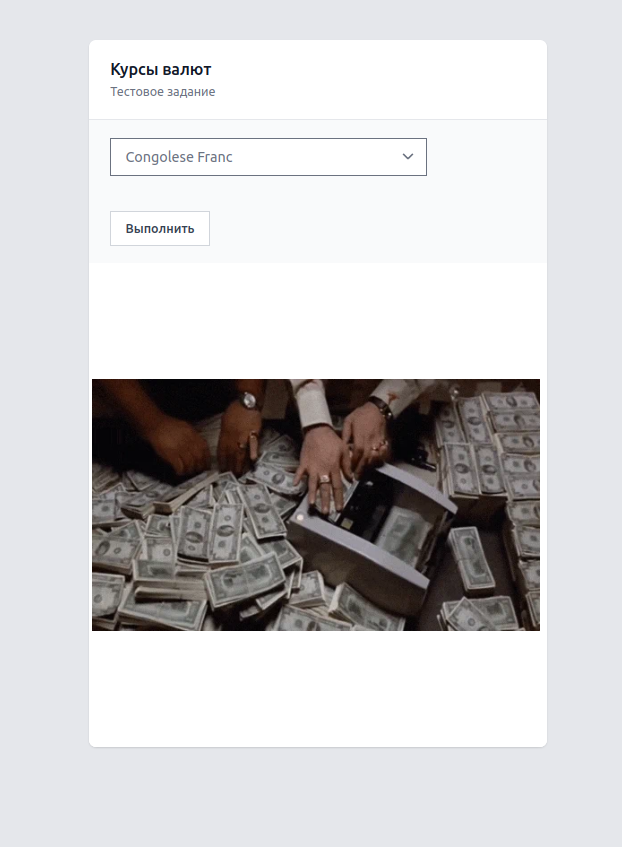

# spring-exchangerates

## Задание

#### Создать сервис, который обращается к сервису курсов валют, и отображает gif:
* Если курс по отношению к USD за сегодня стал выше вчерашнего, то отдаем рандомную отсюда https://giphy.com/search/rich
* Если ниже - отсюда https://giphy.com/search/broke
#### Ссылки
* REST API курсов валют - https://docs.openexchangerates.org/
* REST API гифок - https://developers.giphy.com/docs/api#quick-start-guide
#### Must Have
* Сервис на Spring Boot 2 + Java / Kotlin
* Запросы приходят на HTTP endpoint (должен быть написан в соответствии с rest conventions), туда передается код валюты по отношению с которой сравнивается USD
* Для взаимодействия с внешними сервисами используется Feign
* Все параметры (валюта по отношению к которой смотрится курс, адреса внешних сервисов и т.д.) вынесены в настройки
* На сервис написаны тесты (для мока внешних сервисов можно использовать @mockbean или WireMock)
* Для сборки должен использоваться Gradle
* Результатом выполнения должен быть репо на GitHub с инструкцией по запуску
#### Nice to Have
* Сборка и запуск Docker контейнера с этим сервисом

## Реализация

Проект представлен ввиде веб-страницы (использован шаблонизатор thymeleaf)



## Сборка

Для создания Docker-образа приложения необходимо выполнить команду:
````
docker build -t ssafaryanc/alfabank-exchangerate .
````

Команда запустит сборку JAR-архива, с выполнением тестов

## Запуск

Для запуска Docker-образа необходимо выполнить команду:

````
docker run \
-p 0.0.0.0:9092:9092 \
-e LOG_NAME=example.log \
-e GIPHY_API_KEY=COD9mFVQgbVuKHIGVgk0wVKaFzA48cD5 \
-e OPEN_EXCHANGE_RATE_APP_KEY=dfabc8028fa1443ba6f3229a9382bcc3 \
-v $HOME/logs/:/log \
ssafaryanc/alfabank-exchangerate:latest
````

Переходите [http://0.0.0.0:9092/currency](http://0.0.0.0:9092/currency) 